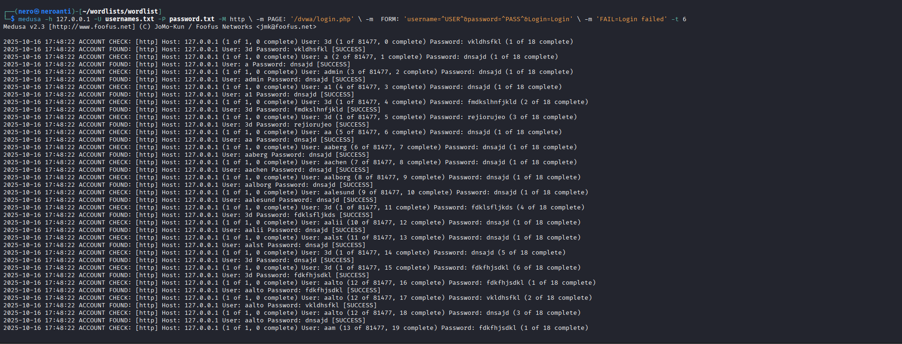
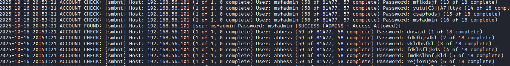
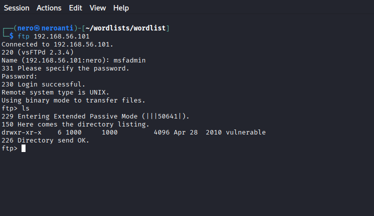
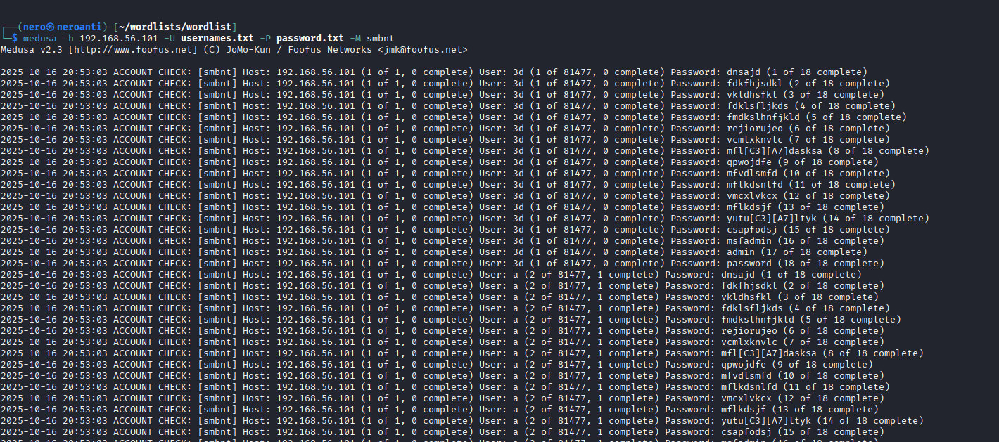
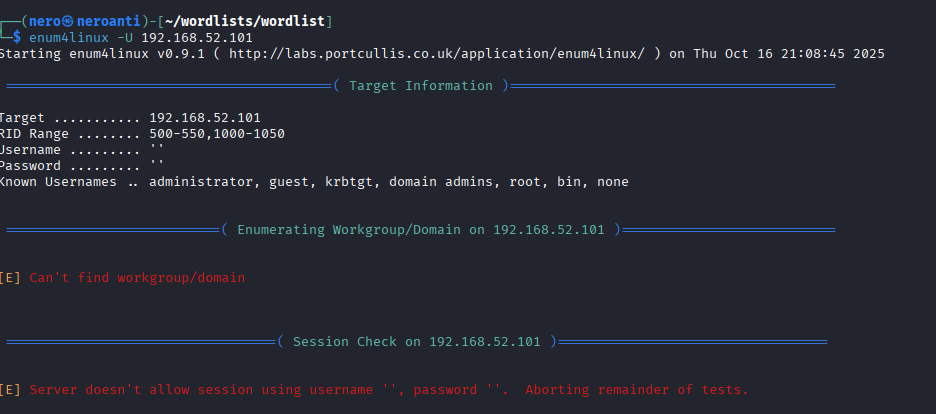
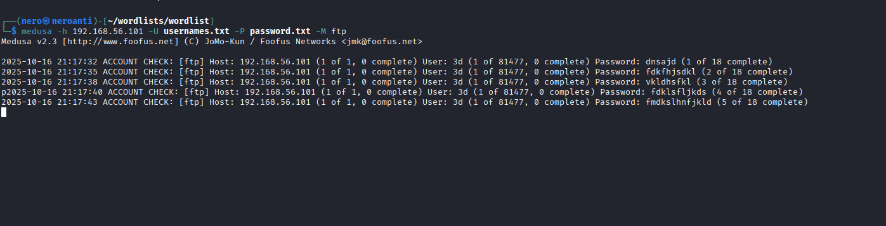

# Teste de Imagens

## Verificação dos caminhos das imagens:

### Imagem 1 - Scan de Portas

### Imagem 2 - Ataque FTP

### Imagem 3 - Resultado FTP

### Imagem 4 - DVWA Login

### Imagem 5 - Enumeração SMB

### Imagem 6 - Ataque SMB

## Caminhos alternativos (sem codificação):

### Imagem 1 - Scan de Portas

### Imagem 2 - Ataque FTP

### Imagem 3 - Resultado FTP

### Imagem 4 - DVWA Login

### Imagem 5 - Enumeração SMB

### Imagem 6 - Ataque SMB

